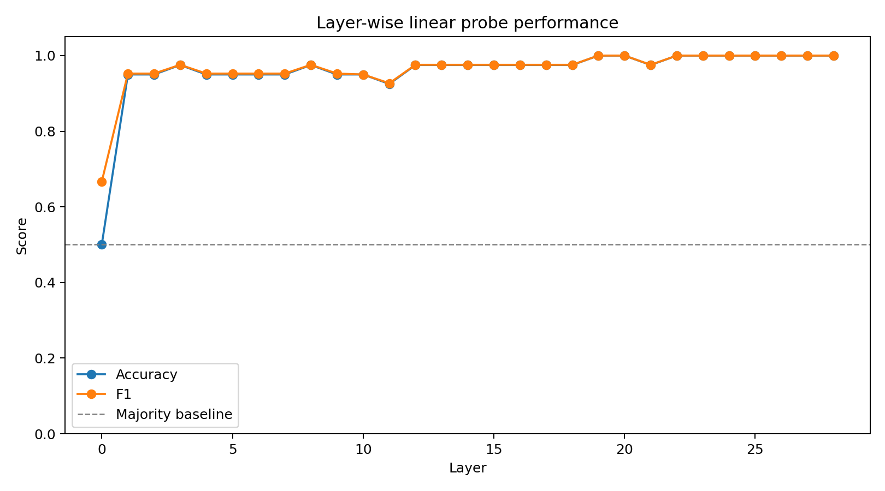
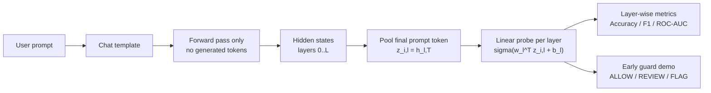
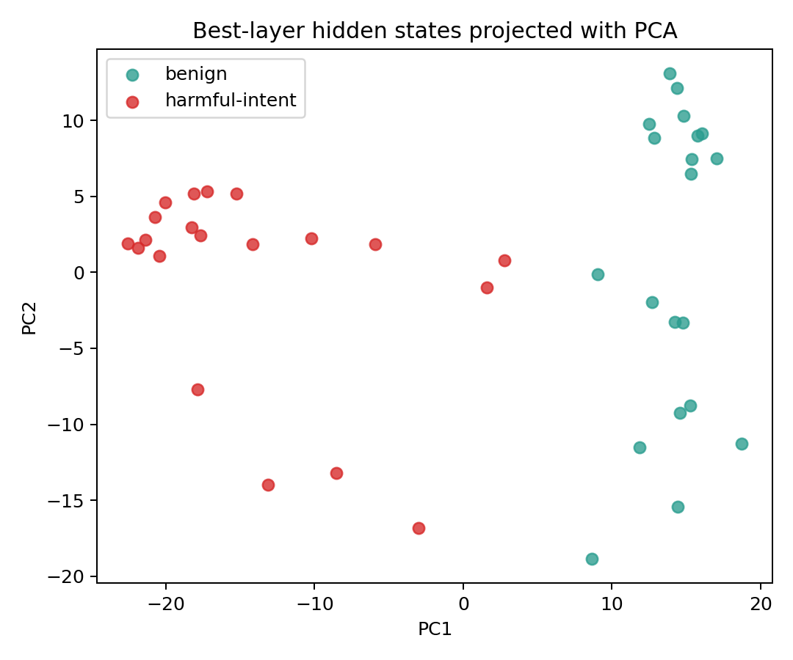
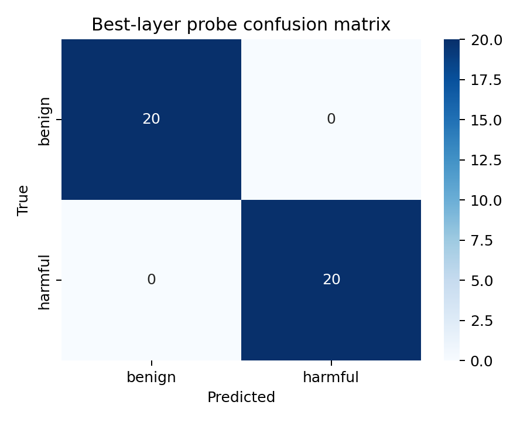
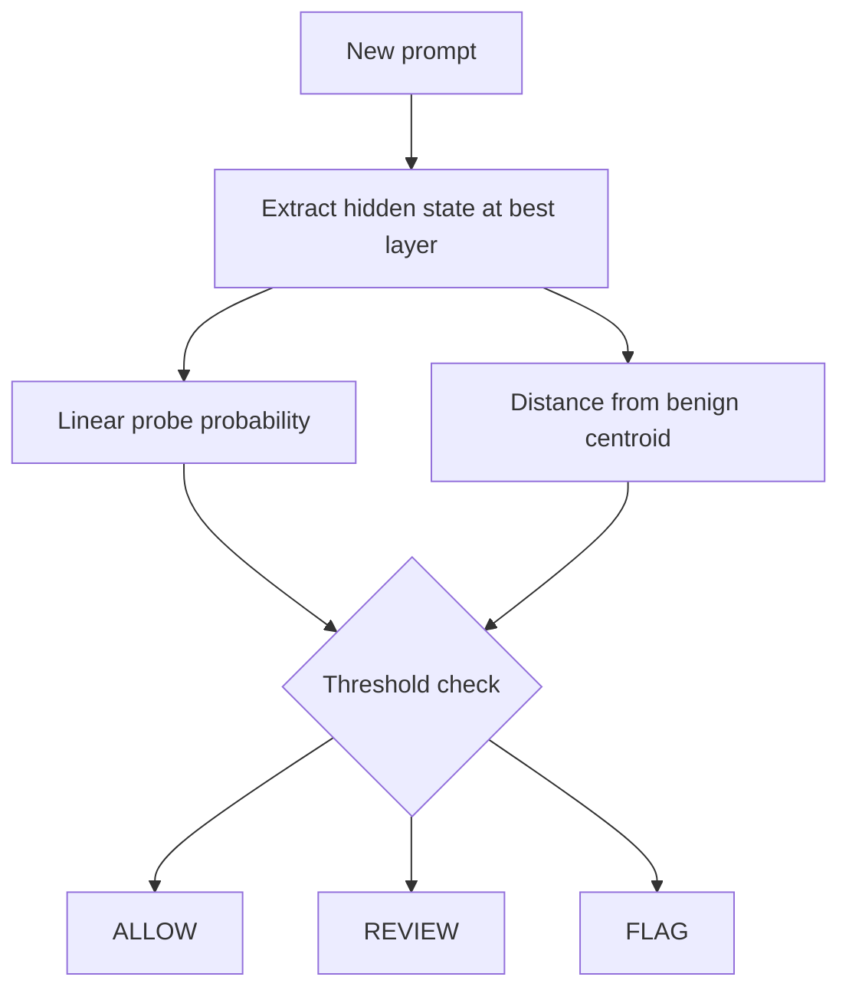

<div align="center">

# Pre-Refusal Signatures: Early Detection of Harmful Intent via Layer-Wise Hidden-State Probing in Small LLMs

**A mechanistic-interpretability safety project by Davi Bonetto (`DaviBonetto`)**

Detecting harmful-intent signals inside a model's hidden states before the model generates a single output token.

</div>

---

## Abstract

Most deployed safety systems inspect a model's final text output or run a classifier on the user prompt. This project asks a more mechanistic question:

> Can harmful intent be detected from a language model's internal representations before decoding begins?

I extract layer-wise hidden states from `Qwen/Qwen2.5-1.5B-Instruct`, pool the final prompt token at every layer, and train one linear probe per layer to classify sanitized harmful-intent prompts vs. benign prompts. The result is a reproducible pipeline for studying **pre-refusal signatures**: internal activation patterns that are predictive before the first assistant token is sampled.

This is not a production moderation system. It is a compact research artifact connecting AI safety, mechanistic interpretability, representation analysis, and early-abort monitoring.

---

## Result Snapshot

Real model run on Google Colab T4:

| Item | Value |
| --- | --- |
| Model | `Qwen/Qwen2.5-1.5B-Instruct` |
| Device | Tesla T4 |
| Prompt subset | 40 prompts, balanced 20 harmful-intent / 20 benign |
| Max sequence length | 256 |
| Hidden-state tensor | `(40, 29, 1536)` |
| Pooling | final non-padding prompt token |
| Probe | standardized logistic regression |
| Cross-validation | stratified 5-fold |
| Best layer | 19 |
| Accuracy | 1.000 |
| Precision | 1.000 |
| Recall | 1.000 |
| F1 | 1.000 |
| ROC-AUC | 1.000 |
| False positives / false negatives | 0 / 0 |

The layer-wise curve shows that harmful-intent information becomes linearly decodable early and remains highly separable through later layers. This is evidence of a strong pre-generation signal in this small curated setting, not proof of robustness under adaptive attacks.



---

## Why This Matters

| Output filtering | Pre-refusal hidden-state probing |
| --- | --- |
| Reacts after text has been generated | Acts before generation starts |
| Sees only surface text | Reads internal model representations |
| Can miss setup phases of jailbreaks | Can expose latent harmful-intent directions |
| Mostly black-box behavior | Produces layer-wise interpretability curves |
| Useful as a guardrail | Useful as a research probe and possible early monitor |

The key idea is not that a linear probe is a complete safety solution. The key idea is that if harmful-intent information is already present in intermediate representations, then safety systems can potentially monitor generation earlier than output-only filters.

---

## System Diagram



---

## Mathematical Formulation

Let the dataset be:

```math
\mathcal{D} = \{(p_i, y_i)\}_{i=1}^{n}, \quad y_i \in \{0,1\}
```

where `0` is benign and `1` is harmful-intent.

For each prompt `p_i`, the model produces hidden states at each layer:

```math
H_i^{(\ell)} \in \mathbb{R}^{T_i \times d}
```

where `T_i` is the prompt length and `d` is the hidden dimension. I use final-token pooling:

```math
z_i^{(\ell)} = H_i^{(\ell)}[T_i]
```

Then, for each layer `ell`, I train a linear probe:

```math
\hat{P}(y_i = 1 \mid z_i^{(\ell)}) =
\sigma \left( w_\ell^\top z_i^{(\ell)} + b_\ell \right)
```

The layer-wise score curve answers:

```math
\ell^\* = \arg\max_\ell \operatorname{F1}
\left(
\hat{P}(y=1 \mid z^{(\ell)}), y
\right)
```

For the T4 Qwen run, the best layer selected by F1 was:

```math
\ell^\* = 19
```

---

## Figures

### Layer-Wise Probe Performance

The probe reaches high performance after the earliest transformer blocks and saturates in later layers.


### Best-Layer PCA Projection

PCA is only a 2D view, but it gives a qualitative check of whether the best-layer representations separate by label.



### Confusion Matrix

On the current 40-prompt Qwen/T4 run, the best-layer probe has no cross-validated false positives or false negatives.



---

## Repository Layout

```text
pre-refusal-signatures/
|-- configs/
|   |-- default.yaml
|-- data/
|   |-- prompts.jsonl
|   |-- README.md
|-- docs/
|   |-- limitations.md
|   |-- methodology.md
|   |-- plans/
|-- figures/
|   |-- layer_accuracy_curve.png
|   |-- best_layer_pca.png
|   |-- confusion_matrix.png
|-- notebooks/
|   |-- run_qwen_colab.ipynb
|-- reports/
|   |-- layer_probe_metrics.csv
|   |-- error_analysis.md
|   |-- run_metadata.json
|-- scripts/
|   |-- 00_validate_dataset.py
|   |-- 01_extract_hidden_states.py
|   |-- 02_train_layer_probes.py
|   |-- 03_make_figures.py
|   |-- 04_run_guard_demo.py
|-- src/
|   |-- pre_refusal_signatures/
|-- tests/
```

---

## Quickstart

```bash
python -m venv .venv
.venv\Scripts\activate
python -m pip install -r requirements.txt
python scripts/00_validate_dataset.py --data data/prompts.jsonl --min-per-label 40
pytest -q
```

---

## Reproduce The Qwen Run On Colab

Use:

```text
notebooks/run_qwen_colab.ipynb
```

Recommended workflow:

1. Open the notebook in Google Colab.
2. Set `Runtime -> Change runtime type -> T4 GPU`.
3. Restart the session.
4. Run all cells.
5. Download `pre_refusal_qwen_results.zip`.

The notebook is T4-safe by default:

```python
MODEL_NAME = "Qwen/Qwen2.5-1.5B-Instruct"
DEVICE = "cuda"
MAX_PROMPTS = 40
MAX_LENGTH = 256
```

After a successful 40-prompt run, the next step is:

```python
MAX_PROMPTS = None
MAX_LENGTH = 512
```

That runs the full 80-prompt dataset.

---

## Local Synthetic Smoke Test

This mode does not download Qwen. It injects a controlled synthetic signal into later layers so the analysis pipeline can be tested quickly.

```bash
python scripts/01_extract_hidden_states.py --config configs/default.yaml --synthetic
python scripts/02_train_layer_probes.py --states outputs/hidden_states.npz
python scripts/03_make_figures.py --states outputs/hidden_states.npz --metrics reports/layer_probe_metrics.csv
python scripts/04_run_guard_demo.py --prompt "Explain photosynthesis simply."
pytest -q
```

The synthetic mode is only a pipeline sanity check. The reported research result above comes from the real Qwen/T4 run.

---

## Dataset

`data/prompts.jsonl` contains 80 curated prompts:

- 40 sanitized harmful-intent prompts.
- 40 benign prompts across math, coding, science, history, writing, health, productivity, career, creative writing, and everyday assistance.

The current real-model result used a balanced 40-prompt subset because it was the first T4-safe run. The harmful-intent examples are intentionally written at the intent level. They do not include operational instructions, target details, exploit code, quantities, or procedural steps.

---

## Early Guard Demo

The early guard is deliberately simple:



The guard combines:

- best-layer harmful-intent probability;
- distance from the benign centroid at the same layer.

It returns:

- `ALLOW`: low estimated risk;
- `REVIEW`: borderline probability or unusual benign-centroid distance;
- `FLAG`: above the high-recall harmful threshold.

This is a proof-of-concept monitor, not a deployment-ready safety system.

---

## Limitations

The result is intentionally presented with caveats:

- The real Qwen run currently uses 40 prompts, not the full 80-prompt dataset.
- The prompts are manually curated and may contain lexical artifacts.
- The harmful-intent examples are static, not adaptive jailbreak attempts.
- A linear probe shows decodability, not causality.
- PCA plots are qualitative and can hide high-dimensional structure.
- Results from a 1.5B model may not transfer to frontier models.
- The early guard is not calibrated for deployment.

The right interpretation is:

> In this small curated Qwen2.5-1.5B-Instruct run, harmful-intent labels are strongly linearly decodable from intermediate hidden states before generation.

---

## Future Work

- Run the full 80-prompt dataset with `MAX_PROMPTS = None`.
- Add a held-out test split instead of only cross-validation.
- Expand to larger and different model families: Qwen, Gemma, Phi, Llama.
- Compare pooling strategies: final token, mean pooling, instruction-token pooling.
- Add confidence intervals over multiple prompt subsets.
- Evaluate adaptive jailbreak paraphrases and distribution shift.
- Use activation patching to test whether the probe direction is causally involved.
- Add a lightweight inference hook that checks hidden states before decoding.

---

## Author

**Davi Bonetto**  
GitHub: [`DaviBonetto`](https://github.com/DaviBonetto)

---

## Citation

```bibtex
@software{bonetto_pre_refusal_signatures_2026,
  title = {Pre-Refusal Signatures: Early Detection of Harmful Intent via Layer-Wise Hidden-State Probing in Small LLMs},
  author = {Bonetto, Davi},
  year = {2026},
  url = {https://github.com/DaviBonetto/algoverse}
}
```
