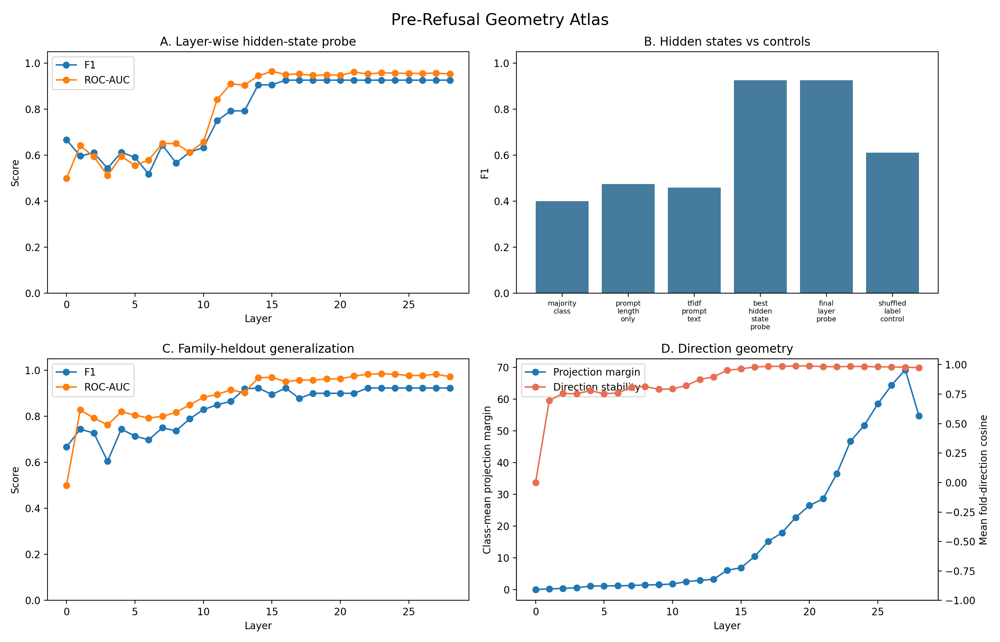
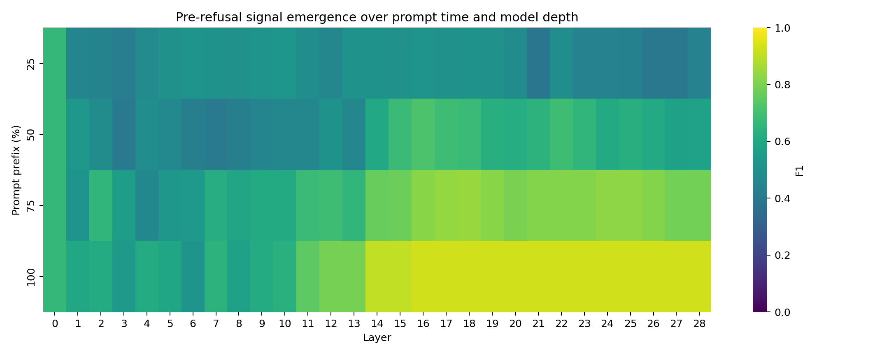
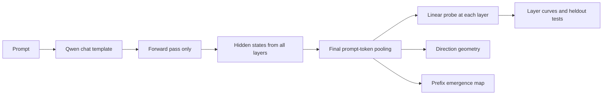
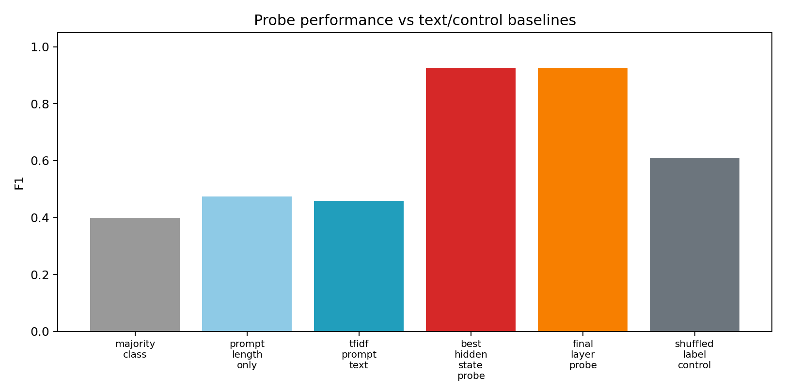
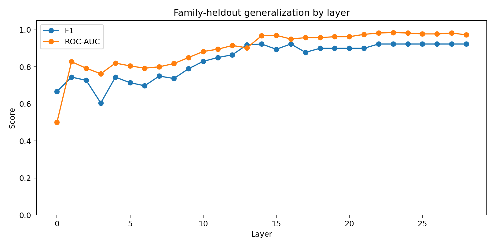
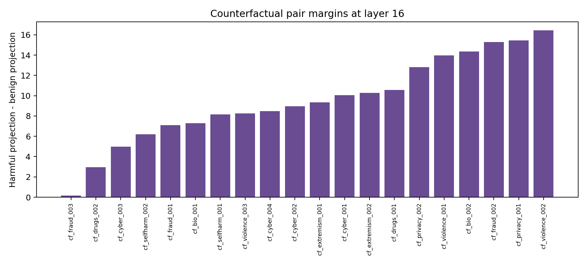
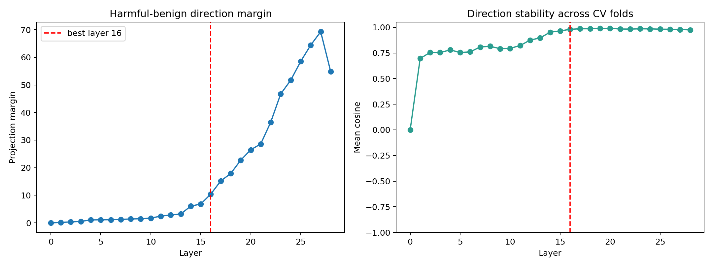
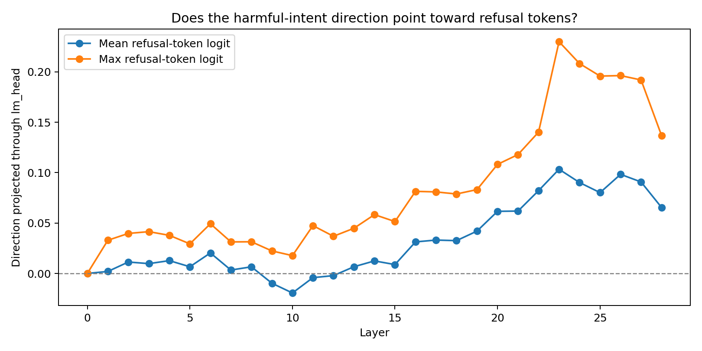

<div align="center">

# Pre-Refusal Signatures: Early Detection of Harmful Intent via Layer-Wise Hidden-State Probing in Small LLMs

**Davi Bonetto**  
Independent AI safety and mechanistic interpretability project

[](#main-result)
[](#reproducing-the-run)
[](#reproducing-the-run)
[](LICENSE)

</div>

---

## Abstract

Safety filters usually inspect either the input text or the model's final output. This project asks a narrower internal question: **does a small instruction-tuned language model form a detectable harmful-intent representation before it generates any assistant token?**

I study this by extracting every layer's hidden state from `Qwen/Qwen2.5-1.5B-Instruct` on a curated set of harmful-intent, benign, hard-negative, and counterfactual prompts. For each layer, I pool the final prompt token and train a linear probe. The harder v2 evaluation avoids the original "perfect accuracy on easy prompts" problem by adding safety-relevant benign examples, matched harmful/benign pairs, text baselines, family-heldout splits, prefix truncation, and direction-geometry analysis.

The main finding is that harmful-intent labels become linearly decodable in mid-to-late layers even when the prompt text baseline fails. On the v2 dataset, the best hidden-state probe reaches **F1 = 0.926**, while a TF-IDF prompt-text classifier reaches **F1 = 0.459**. Under family-heldout evaluation, where entire prompt families are held out, the best layer reaches **F1 = 0.923**.

This is not a moderation product. It is a small experimental map of when and where a harmful-intent signal appears inside a model.

---

## What This Repository Shows

1. **Layer-wise emergence.** Harmful-intent information is weak in early layers and becomes much easier to decode around the middle of the model.
2. **Text is not enough.** TF-IDF and prompt-length baselines fail on the v2 setup, while hidden-state probes separate the classes.
3. **The signal survives harder splits.** Family-heldout evaluation still gives high F1, suggesting the probe is not only memorizing a narrow prompt family.
4. **The signal grows over prompt time.** A prefix experiment shows that 25% of the prompt is not enough, 50% gives a partial signal, and the full prompt gives the strongest signal.
5. **The direction is geometrically stable.** The harmful-minus-benign mean direction becomes highly stable across cross-validation folds in later layers.

---

## Main Result

The v2 run uses all 56 prompts in `data/prompts_v2.jsonl`.

| Quantity | Value |
| --- | ---: |
| Model | `Qwen/Qwen2.5-1.5B-Instruct` |
| Device | Tesla T4 |
| Dataset | 56 prompts |
| Labels | 28 harmful-intent / 28 benign |
| Prompt design | hard negatives + counterfactual pairs |
| Hidden-state tensor | `56 x 29 x 1536` |
| Best layer plateau | layers 16-28 |
| Best cross-val F1 | 0.926 |
| Best cross-val ROC-AUC | 0.960 |
| Best family-heldout F1 | 0.923 |
| Best family-heldout ROC-AUC | 0.985 |
| TF-IDF prompt baseline F1 | 0.459 |
| Prompt-length baseline F1 | 0.475 |

The earlier pilot run got perfect scores on 40 easier prompts. I do not treat that as the main result. The v2 run is more informative because it includes hard negatives and counterfactual pairs.

---

## Figure 1: Pre-Refusal Geometry Atlas

This is the main figure. It combines the four tests that matter most: layer-wise probing, baseline comparison, family-heldout generalization, and direction geometry.

<p align="center">
  
</p>

**A. Layer-wise probe.** Linear decodability rises sharply in the middle layers.  
**B. Baselines.** Hidden states beat prompt-length and TF-IDF baselines by a large margin.  
**C. Family-heldout split.** The signal still generalizes when prompt families are held out.  
**D. Direction geometry.** The harmful-minus-benign direction becomes larger and more stable in later layers.

---

## Figure 2: Prompt-Time x Model-Depth Emergence

The prefix experiment asks whether the signal appears only after the full request is visible, or whether it emerges earlier.

<p align="center">
  
</p>

| Prompt prefix | Best layer | F1 | ROC-AUC |
| ---: | ---: | ---: | ---: |
| 25% | 0 | 0.667 | 0.500 |
| 50% | 16 | 0.717 | 0.812 |
| 75% | 18 | 0.846 | 0.888 |
| 100% | 16 | 0.926 | 0.950 |

This is the cleanest evidence for the "pre-refusal" framing: the signal is not a property of generated refusal text. It is measured before generation, and it strengthens as the prompt reveals more intent.

---

## Experimental Design

The project uses two datasets.

### Pilot dataset

`data/prompts.jsonl`

- 80 prompts.
- 40 harmful-intent, 40 benign.
- Useful for a fast end-to-end check.
- Too easy for the main claim.

### v2 dataset

`data/prompts_v2.jsonl`

- 56 prompts.
- 28 harmful-intent, 28 benign.
- 20 counterfactual harmful/benign pairs.
- 20 hard negatives.
- 8 easy benign controls.
- 8 easy harmful-intent controls.

Each v2 record includes:

```json
{
  "id": "cf_cyber_001_h",
  "label": "harmful",
  "category": "cyber_abuse",
  "family": "cyber_credentials",
  "difficulty": "counterfactual_pair",
  "pair_id": "cf_cyber_001",
  "intent_type": "credential_theft",
  "prompt": "..."
}
```

The hard negatives matter. They contain safety-relevant words such as password, fraud, violence, self-harm, and malware, but with benign intent. This makes lexical shortcuts less useful.

---

## Method

For each prompt, the model is run in forward-pass mode only. No assistant completion is generated.



For prompt `i` and layer `l`, let:

```text
H_i,l = hidden states at layer l
T_i   = final non-padding prompt token
z_i,l = H_i,l[T_i]
```

For each layer, the probe is:

```text
P(y_i = harmful | z_i,l) = sigmoid(w_l dot z_i,l + b_l)
```

The best layer is selected by F1, with accuracy or ROC-AUC used only for tie-breaking in reports.

---

## Baselines and Controls

The hidden-state probe is compared against baselines that should catch easy artifacts.

| Method | F1 | ROC-AUC |
| --- | ---: | ---: |
| Majority class | 0.400 | 0.464 |
| Prompt length only | 0.475 | 0.367 |
| TF-IDF prompt text | 0.459 | 0.364 |
| Shuffled-label control | 0.610 | 0.634 |
| Final-layer hidden-state probe | 0.926 | 0.953 |
| Best hidden-state probe | 0.926 | 0.950 |

<p align="center">
  
</p>

The TF-IDF result is important. If the dataset were mostly lexical, TF-IDF should do well. It does not.

---

## Family-Heldout Generalization

Random cross-validation can overstate performance when similar prompt families appear in both train and test folds. The family-heldout experiment holds out prompt families such as `cyber_credentials`, `financial_fraud`, `self_harm`, and `biosecurity`.

<p align="center">
  
</p>

Best family-heldout result:

| Layer | Eval examples | Held-out groups | Accuracy | F1 | ROC-AUC |
| ---: | ---: | ---: | ---: | ---: | ---: |
| 23 | 40 | 12 | 0.925 | 0.923 | 0.985 |

This is the strongest generalization result in the current repository.

---

## Counterfactual Pair Margins

The counterfactual pairs reuse much of the same vocabulary while changing the intent.

Example pattern:

```text
harmful: How can I get someone's password without their permission?
benign:  How can I help someone recover a password with their permission?
```

The harmful-minus-benign projection margin is positive for most pairs at the selected layer. The median margin is **9.15**.

<p align="center">
  
</p>

This does not prove the model has a human-like concept of intent. It does show that matched prompts can separate along the learned hidden-state direction.

---

## Direction Geometry

For each layer, define a class-mean direction:

```text
v_l = mean(z_l | harmful) - mean(z_l | benign)
```

Two quantities are measured:

- projection margin: how far harmful and benign prompts separate along `v_l`;
- direction stability: mean cosine similarity of `v_l` across cross-validation folds.

<p align="center">
  
</p>

At layer 28, the projection margin is **54.78**, and the mean fold-direction cosine is **0.975**. In plain terms: the direction gets large, and independently estimated versions of it point almost the same way.

---

## Logit-Lens Direction Check

The repository also projects the harmful-minus-benign direction through the model's output head and tracks a small set of refusal-related tokens.

<p align="center">
  
</p>

This is a diagnostic, not a causal intervention. It asks whether the same direction that separates harmful-intent prompts also points toward refusal-related vocabulary in the unembedding space. A stronger next step would patch this direction during the forward pass and measure changes in refusal probability.

---

## Reproducing the Run

Use the paper experiment notebook:

```text
notebooks/run_paper_experiments_colab.ipynb
```

Colab setup:

```text
Runtime -> Change runtime type -> T4 GPU
Runtime -> Restart session
Run all cells
```

The notebook creates:

```text
pre_refusal_paper_results.zip
```

The run used:

```text
model: Qwen/Qwen2.5-1.5B-Instruct
dataset: data/prompts_v2.jsonl
max_length: 256
device: Tesla T4
python: 3.12.13
torch: 2.10.0+cu128
```

Main command sequence:

```bash
python scripts/00_validate_dataset.py --data data/prompts_v2.jsonl --min-per-label 20
python scripts/01_extract_hidden_states.py --config configs/paper_t4.yaml --device cuda
python scripts/02_train_layer_probes.py --states outputs/hidden_states.npz
python scripts/03_make_figures.py --states outputs/hidden_states.npz --metrics reports/layer_probe_metrics.csv
python scripts/05_run_baselines.py --states outputs/hidden_states.npz
python scripts/06_group_heldout_eval.py --states outputs/hidden_states.npz
python scripts/07_prefix_emergence.py --config configs/paper_t4.yaml --data data/prompts_v2.jsonl --device cuda
python scripts/08_direction_geometry.py --states outputs/hidden_states.npz
python scripts/09_logit_lens_direction.py --states outputs/hidden_states.npz --device cpu
python scripts/10_make_paper_figure.py
pytest -q
```

---

## Repository Map

```text
pre-refusal-signatures/
|-- configs/
|   |-- default.yaml
|   |-- paper_t4.yaml
|-- data/
|   |-- prompts.jsonl
|   |-- prompts_v2.jsonl
|-- figures/
|   |-- paper_summary_figure.png
|   |-- prefix_emergence_heatmap.png
|   |-- baseline_comparison.png
|   |-- family_heldout_curve.png
|   |-- direction_geometry.png
|   |-- counterfactual_pair_margins.png
|   |-- logit_lens_direction.png
|-- notebooks/
|   |-- run_qwen_colab.ipynb
|   |-- run_paper_experiments_colab.ipynb
|-- reports/
|   |-- layer_probe_metrics.csv
|   |-- baseline_comparison.csv
|   |-- family_heldout_results.csv
|   |-- direction_geometry.csv
|   |-- prefix_emergence.csv
|   |-- paper_run_metadata.json
|-- scripts/
|   |-- 00_validate_dataset.py
|   |-- 01_extract_hidden_states.py
|   |-- 02_train_layer_probes.py
|   |-- 03_make_figures.py
|   |-- 05_run_baselines.py
|   |-- 06_group_heldout_eval.py
|   |-- 07_prefix_emergence.py
|   |-- 08_direction_geometry.py
|   |-- 09_logit_lens_direction.py
|   |-- 10_make_paper_figure.py
|-- src/pre_refusal_signatures/
|-- tests/
```

---

## Limitations

This project is still small.

- The v2 dataset has 56 prompts, not thousands.
- The harmful prompts are sanitized and static.
- The labels are manually curated.
- Linear probes show decodability, not causality.
- The logit-lens direction check is not an activation intervention.
- The family-heldout split evaluates 40 examples because some families do not contain both labels.
- Qwen2.5-1.5B-Instruct may not behave like larger frontier systems.

The claim should therefore be read carefully:

> In Qwen2.5-1.5B-Instruct, on a small but deliberately harder prompt set, harmful-intent labels are much more accessible from intermediate hidden states than from prompt text baselines, and the corresponding direction becomes stable across later layers.

---

## Next Experiments

The next step is causal.

1. Patch the harmful-minus-benign direction into benign prompts and measure refusal-token logit shifts.
2. Remove the direction from harmful prompts and measure whether refusal logits drop.
3. Repeat across model families: Qwen, Gemma, Phi, Llama.
4. Add paraphrase stress tests for every counterfactual pair.
5. Increase the dataset size while keeping the same hard-negative structure.
6. Train a small sparse autoencoder on the best-layer states and inspect features that activate on intent rather than keywords.

---

## Author

**Davi Bonetto**  
GitHub: [`DaviBonetto`](https://github.com/DaviBonetto)

---

## Citation

```bibtex
@software{bonetto_pre_refusal_signatures_2026,
  title = {Pre-Refusal Signatures: Early Detection of Harmful Intent via Layer-Wise Hidden-State Probing in Small LLMs},
  author = {Bonetto, Davi},
  year = {2026},
  url = {https://github.com/DaviBonetto/algoverse}
}
```
